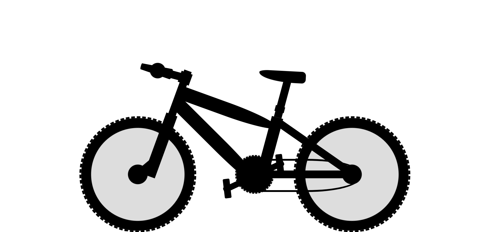

# bicycle

## Description
This project is created using HTML and CSS.  CSS is used to shape the divs into the shape of a bicycle.  To add movement to the bicycle keyframe animations are used.  Keyframes are added to the wheels, crank, and pedals of the bike to give the illusion that the pedals are turning the wheels of the bike.

## Demo
A demo for the project can be found at: https://tod619.github.io/bicycle/
